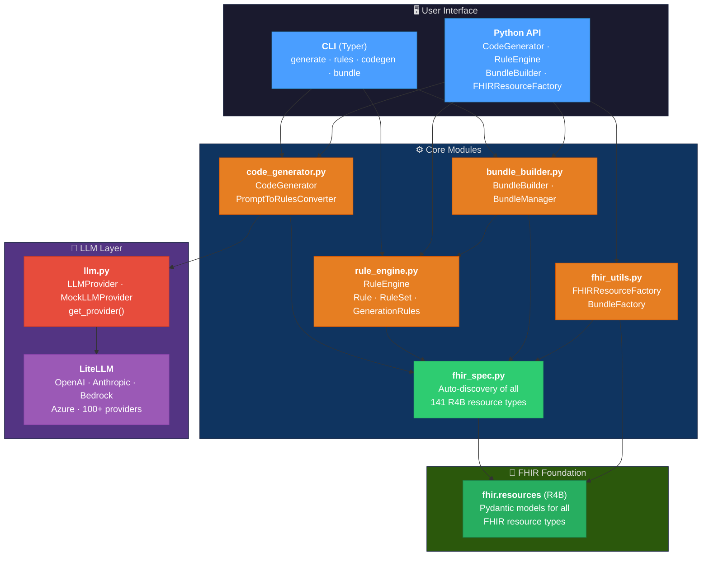
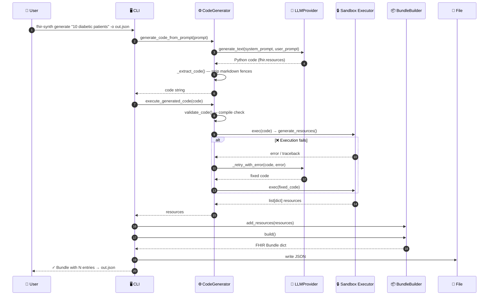
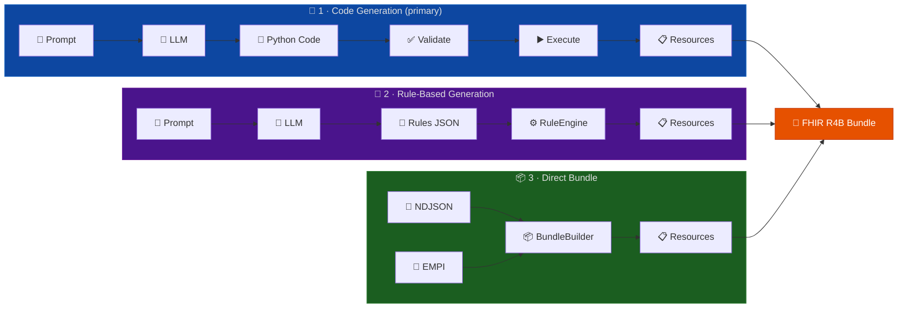
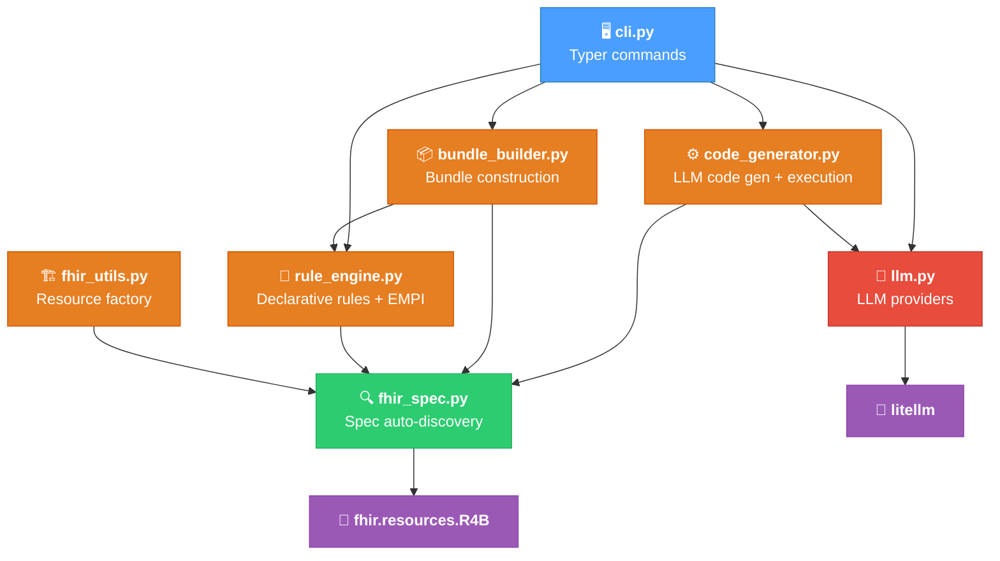
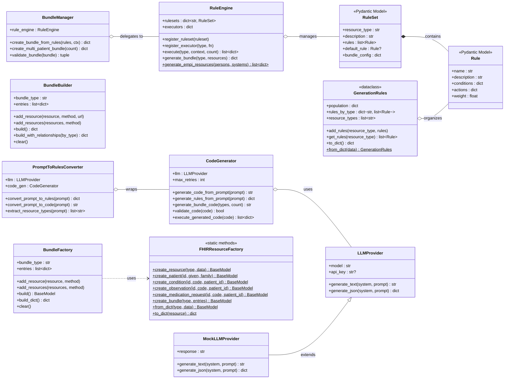
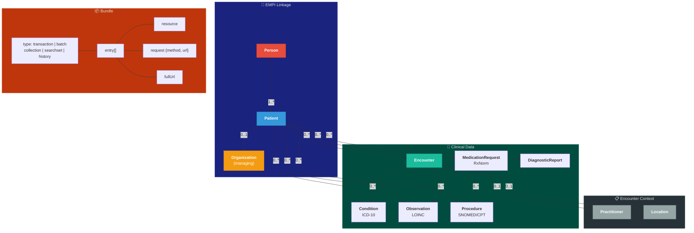
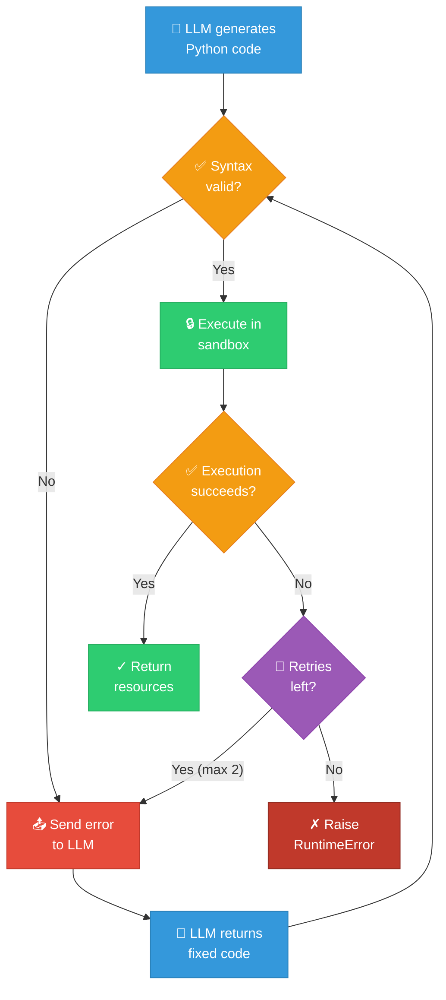
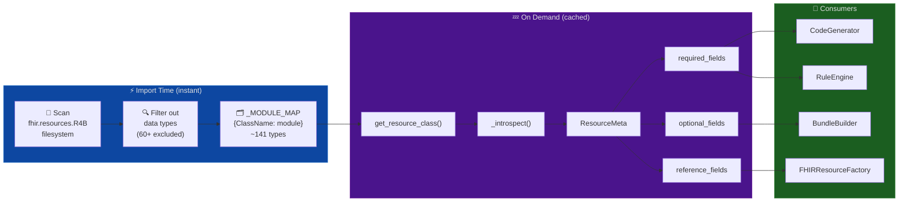
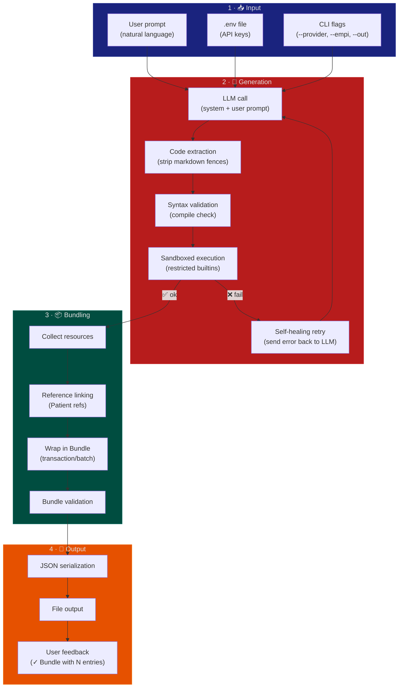
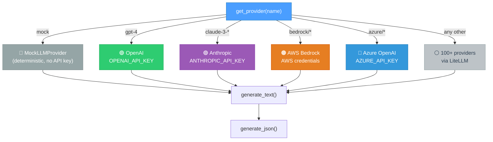

# FHIR Synth — Architecture
## System Overview

---
## End-to-End Data Flow — `generate` Command

---
## Three Generation Workflows

---
## Module Dependency Graph

---
## Class Diagram

---
## FHIR Resource Relationships

---
## Self-Healing Code Execution

---
## FHIR Spec Auto-Discovery

---
## Processing Pipeline

---
## LLM Provider Integration

---
## File Structure
```
fhir-synth/
├── src/fhir_synth/
│   ├── __init__.py            # Package exports, .env loading
│   ├── cli.py                 # Typer CLI: generate, rules, codegen, bundle
│   ├── code_generator.py      # CodeGenerator, PromptToRulesConverter
│   ├── rule_engine.py         # Rule, RuleSet, RuleEngine, GenerationRules
│   ├── bundle_builder.py      # BundleBuilder, BundleManager
│   ├── fhir_utils.py          # FHIRResourceFactory, BundleFactory
│   ├── fhir_spec.py           # Auto-discovery of 141 R4B resource types
│   └── llm.py                 # LLMProvider, MockLLMProvider, get_provider()
│
├── tests/
│   ├── test_bundle_builder.py
│   ├── test_code_generator.py
│   ├── test_empi.py
│   ├── test_fhir_spec.py
│   ├── test_fhir_utils.py
│   ├── test_llm.py
│   └── test_rule_engine.py
│
├── pyproject.toml             # Hatch build, ruff, mypy, pytest config
├── README.md                  # Usage docs and quick start
└── ARCHITECTURE.md            # This file
```
