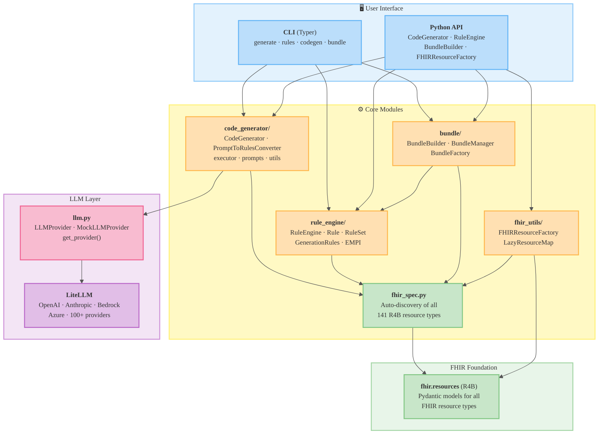
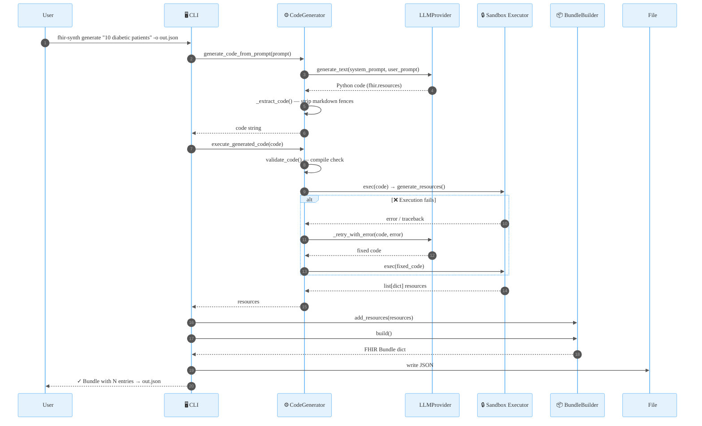
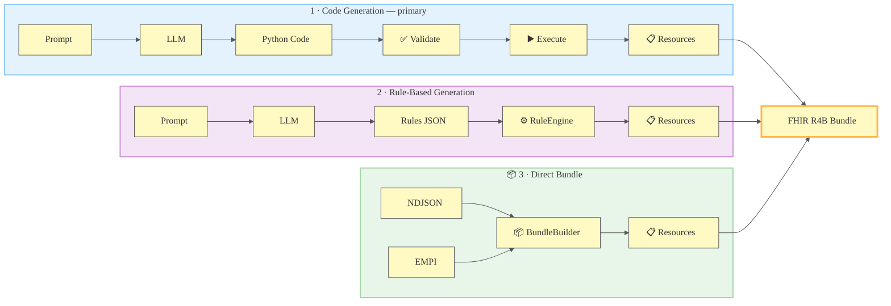
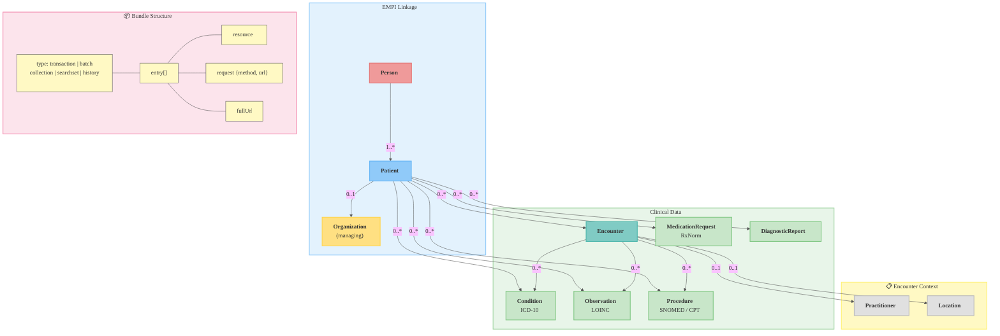
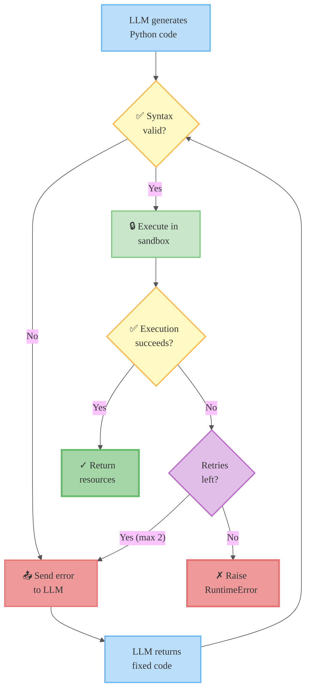
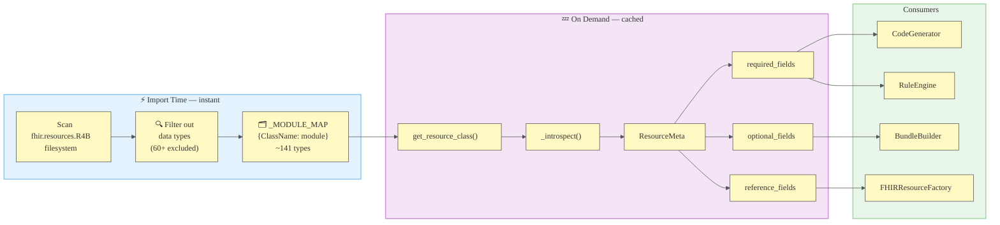
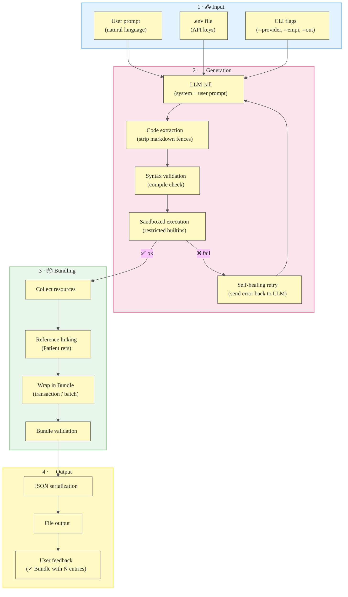
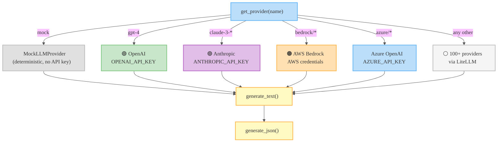

# FHIR Synth — Architecture

## System Overview

---

## End-to-End Data Flow — `generate` Command

---

## Three Generation Workflows

---

## FHIR Resource Relationships

---

## Self-Healing Code Execution

---

## FHIR Spec Auto-Discovery

---

## Processing Pipeline

---

## LLM Provider Integration

