# FHIR Synth — Architecture

## System Overview

```mermaid
%%{init: {'theme': 'base', 'themeVariables': {'primaryColor': '#fff9c4', 'primaryTextColor': '#333', 'primaryBorderColor': '#555', 'lineColor': '#555', 'secondaryColor': '#e8f5e9', 'tertiaryColor': '#e3f2fd', 'fontFamily': 'Comic Sans MS, cursive, sans-serif', 'fontSize': '14px'}}}%%
graph TB
    subgraph UI["🖥️ User Interface"]
        CLI["<b>CLI</b> (Typer)<br/>generate · rules · codegen · bundle"]
        API["<b>Python API</b><br/>CodeGenerator · RuleEngine<br/>BundleBuilder · FHIRResourceFactory"]
    end

    subgraph CORE["⚙️ Core Modules"]
        CG["<b>code_generator/</b><br/>CodeGenerator · PromptToRulesConverter<br/>executor · prompts · utils"]
        RE["<b>rule_engine/</b><br/>RuleEngine · Rule · RuleSet<br/>GenerationRules · EMPI"]
        BB["<b>bundle/</b><br/>BundleBuilder · BundleManager<br/>BundleFactory"]
        FU["<b>fhir_utils/</b><br/>FHIRResourceFactory<br/>LazyResourceMap"]
        FS["<b>fhir_spec.py</b><br/>Auto-discovery of all<br/>141 R4B resource types"]
    end

    subgraph LLM_LAYER["🤖 LLM Layer"]
        LLM["<b>llm.py</b><br/>LLMProvider · MockLLMProvider<br/>get_provider()"]
        LITELLM["<b>LiteLLM</b><br/>OpenAI · Anthropic · Bedrock<br/>Azure · 100+ providers"]
    end

    subgraph FHIR["🏥 FHIR Foundation"]
        FR["<b>fhir.resources</b> (R4B)<br/>Pydantic models for all<br/>FHIR resource types"]
    end

    CLI --> CG
    CLI --> RE
    CLI --> BB
    API --> CG
    API --> RE
    API --> BB
    API --> FU

    CG --> LLM
    CG --> FS
    RE --> FS
    BB --> RE
    BB --> FS
    FU --> FS
    LLM --> LITELLM
    FS --> FR
    FU --> FR

    style UI fill:#e3f2fd,stroke:#90caf9,color:#333,stroke-width:2px
    style CORE fill:#fff9c4,stroke:#fff176,color:#333,stroke-width:2px
    style LLM_LAYER fill:#f3e5f5,stroke:#ce93d8,color:#333,stroke-width:2px
    style FHIR fill:#e8f5e9,stroke:#a5d6a7,color:#333,stroke-width:2px

    style CLI fill:#bbdefb,stroke:#64b5f6,color:#333,stroke-width:2px
    style API fill:#bbdefb,stroke:#64b5f6,color:#333,stroke-width:2px
    style CG fill:#ffe0b2,stroke:#ffb74d,color:#333,stroke-width:2px
    style RE fill:#ffe0b2,stroke:#ffb74d,color:#333,stroke-width:2px
    style BB fill:#ffe0b2,stroke:#ffb74d,color:#333,stroke-width:2px
    style FU fill:#ffe0b2,stroke:#ffb74d,color:#333,stroke-width:2px
    style FS fill:#c8e6c9,stroke:#81c784,color:#333,stroke-width:2px
    style LLM fill:#f8bbd0,stroke:#f06292,color:#333,stroke-width:2px
    style LITELLM fill:#e1bee7,stroke:#ba68c8,color:#333,stroke-width:2px
    style FR fill:#c8e6c9,stroke:#81c784,color:#333,stroke-width:2px
```

---

## End-to-End Data Flow — `generate` Command

```mermaid
%%{init: {'theme': 'base', 'themeVariables': {'primaryColor': '#fff9c4', 'primaryTextColor': '#333', 'lineColor': '#555', 'actorBkg': '#e3f2fd', 'actorBorder': '#64b5f6', 'actorTextColor': '#333', 'activationBkgColor': '#fff9c4', 'activationBorderColor': '#ffb74d', 'signalColor': '#555', 'signalTextColor': '#333', 'noteBkgColor': '#fff9c4', 'noteBorderColor': '#ffb74d', 'altSectionBkgColor': '#ffebee', 'fontFamily': 'Comic Sans MS, cursive, sans-serif'}}}%%
sequenceDiagram
    autonumber
    participant U as 👤 User
    participant CLI as 🖥️ CLI
    participant CG as ⚙️ CodeGenerator
    participant LLM as 🤖 LLMProvider
    participant EX as 🔒 Sandbox Executor
    participant BB as 📦 BundleBuilder
    participant F as 💾 File

    U->>CLI: fhir-synth generate "10 diabetic patients" -o out.json
    CLI->>CG: generate_code_from_prompt(prompt)
    CG->>LLM: generate_text(system_prompt, user_prompt)
    LLM-->>CG: Python code (fhir.resources)
    CG->>CG: _extract_code() — strip markdown fences
    CG-->>CLI: code string

    CLI->>CG: execute_generated_code(code)
    CG->>CG: validate_code() — compile check
    CG->>EX: exec(code) → generate_resources()

    alt ❌ Execution fails
        EX-->>CG: error / traceback
        CG->>LLM: _retry_with_error(code, error)
        LLM-->>CG: fixed code
        CG->>EX: exec(fixed_code)
    end

    EX-->>CG: list[dict] resources
    CG-->>CLI: resources

    CLI->>BB: add_resources(resources)
    CLI->>BB: build()
    BB-->>CLI: FHIR Bundle dict

    CLI->>F: write JSON
    CLI-->>U: ✓ Bundle with N entries → out.json
```

---

## Three Generation Workflows

---

## FHIR Resource Relationships

---

## Self-Healing Code Execution

```mermaid
%%{init: {'theme': 'base', 'themeVariables': {'primaryColor': '#fff9c4', 'primaryTextColor': '#333', 'primaryBorderColor': '#555', 'lineColor': '#555', 'fontFamily': 'Comic Sans MS, cursive, sans-serif'}}}%%
flowchart TD
    A["🤖 LLM generates<br/>Python code"] --> B{"✅ Syntax<br/>valid?"}
    B -->|No| C["📤 Send error<br/>to LLM"]
    B -->|Yes| D["🔒 Execute in<br/>sandbox"]
    D --> E{"✅ Execution<br/>succeeds?"}
    E -->|Yes| F["✓ Return<br/>resources"]
    E -->|No| G{"🔄 Retries<br/>left?"}
    G -->|"Yes (max 2)"| C
    G -->|No| H["✗ Raise<br/>RuntimeError"]
    C --> I["🤖 LLM returns<br/>fixed code"]
    I --> B

    style A fill:#bbdefb,stroke:#64b5f6,color:#333,stroke-width:2px
    style B fill:#fff9c4,stroke:#ffb74d,color:#333,stroke-width:2px
    style C fill:#ef9a9a,stroke:#e57373,color:#333,stroke-width:2px
    style D fill:#c8e6c9,stroke:#81c784,color:#333,stroke-width:2px
    style E fill:#fff9c4,stroke:#ffb74d,color:#333,stroke-width:2px
    style F fill:#a5d6a7,stroke:#66bb6a,color:#333,stroke-width:3px
    style G fill:#e1bee7,stroke:#ba68c8,color:#333,stroke-width:2px
    style H fill:#ef9a9a,stroke:#e57373,color:#333,stroke-width:3px
    style I fill:#bbdefb,stroke:#64b5f6,color:#333,stroke-width:2px
```

---

## FHIR Spec Auto-Discovery

```mermaid
%%{init: {'theme': 'base', 'themeVariables': {'primaryColor': '#fff9c4', 'primaryTextColor': '#333', 'primaryBorderColor': '#555', 'lineColor': '#555', 'fontFamily': 'Comic Sans MS, cursive, sans-serif'}}}%%
flowchart LR
    subgraph IMPORT["⚡ Import Time — instant"]
        SCAN["📂 Scan<br/>fhir.resources.R4B<br/>filesystem"] --> FILTER["🔍 Filter out<br/>data types<br/>(60+ excluded)"]
        FILTER --> MAP["🗂️ _MODULE_MAP<br/>{ClassName: module}<br/>~141 types"]
    end

    subgraph DEMAND["💤 On Demand — cached"]
        MAP --> GRC["get_resource_class()"]
        GRC --> INTRO["_introspect()"]
        INTRO --> META["ResourceMeta"]
        META --> REQ["required_fields"]
        META --> OPT["optional_fields"]
        META --> REF["reference_fields"]
    end

    subgraph CONSUMERS["🔌 Consumers"]
        REQ --> CG2["CodeGenerator"]
        REQ --> RE2["RuleEngine"]
        OPT --> BB2["BundleBuilder"]
        REF --> FU2["FHIRResourceFactory"]
    end

    style IMPORT fill:#e3f2fd,stroke:#90caf9,color:#333,stroke-width:2px
    style DEMAND fill:#f3e5f5,stroke:#ce93d8,color:#333,stroke-width:2px
    style CONSUMERS fill:#e8f5e9,stroke:#a5d6a7,color:#333,stroke-width:2px
```

---

## Processing Pipeline

---

## LLM Provider Integration

```mermaid
%%{init: {'theme': 'base', 'themeVariables': {'primaryColor': '#fff9c4', 'primaryTextColor': '#333', 'primaryBorderColor': '#555', 'lineColor': '#555', 'fontFamily': 'Comic Sans MS, cursive, sans-serif'}}}%%
graph TD
    GP["get_provider(name)"]

    GP -->|"mock"| MOCK["🧪 MockLLMProvider<br/>(deterministic, no API key)"]
    GP -->|"gpt-4"| GPT["🟢 OpenAI<br/>OPENAI_API_KEY"]
    GP -->|"claude-3-*"| CLAUDE["🟣 Anthropic<br/>ANTHROPIC_API_KEY"]
    GP -->|"bedrock/*"| BEDROCK["🟠 AWS Bedrock<br/>AWS credentials"]
    GP -->|"azure/*"| AZURE["🔵 Azure OpenAI<br/>AZURE_API_KEY"]
    GP -->|"any other"| OTHER["⚪ 100+ providers<br/>via LiteLLM"]

    MOCK --> GEN_TEXT["generate_text()"]
    GPT --> GEN_TEXT
    CLAUDE --> GEN_TEXT
    BEDROCK --> GEN_TEXT
    AZURE --> GEN_TEXT
    OTHER --> GEN_TEXT

    GEN_TEXT --> GEN_JSON["generate_json()"]

    style GP fill:#bbdefb,stroke:#64b5f6,color:#333,stroke-width:2px
    style MOCK fill:#e0e0e0,stroke:#bdbdbd,color:#333,stroke-width:2px
    style GPT fill:#c8e6c9,stroke:#81c784,color:#333,stroke-width:2px
    style CLAUDE fill:#e1bee7,stroke:#ba68c8,color:#333,stroke-width:2px
    style BEDROCK fill:#ffe0b2,stroke:#ffb74d,color:#333,stroke-width:2px
    style AZURE fill:#bbdefb,stroke:#64b5f6,color:#333,stroke-width:2px
    style OTHER fill:#f5f5f5,stroke:#bdbdbd,color:#333,stroke-width:2px
    style GEN_TEXT fill:#fff9c4,stroke:#ffb74d,color:#333,stroke-width:2px
    style GEN_JSON fill:#fff9c4,stroke:#ffb74d,color:#333,stroke-width:2px
```

