# FHIR Synth — Architecture
## System Overview

---
## End-to-End Data Flow — `generate` Command

```mermaid
sequenceDiagram
    autonumber
    participant U as 👤 User
    participant CLI as 🖥️ CLI
    participant CG as ⚙️ CodeGenerator
    participant LLM as 🤖 LLMProvider
    participant EX as 🔒 Sandbox Executor
    participant BB as 📦 BundleBuilder
    participant F as 💾 File
    U->>CLI: fhir-synth generate "10 diabetic patients" -o out.json
    CLI->>CG: generate_code_from_prompt(prompt)
    CG->>LLM: generate_text(system_prompt, user_prompt)
    LLM-->>CG: Python code (fhir.resources)
    CG->>CG: _extract_code() — strip markdown fences
    CG-->>CLI: code string
    CLI->>CG: execute_generated_code(code)
    CG->>CG: validate_code() — compile check
    CG->>EX: exec(code) → generate_resources()
    alt ❌ Execution fails
        EX-->>CG: error / traceback
        CG->>LLM: _retry_with_error(code, error)
        LLM-->>CG: fixed code
        CG->>EX: exec(fixed_code)
    end
    EX-->>CG: list[dict] resources
    CG-->>CLI: resources
    CLI->>BB: add_resources(resources)
    CLI->>BB: build()
    BB-->>CLI: FHIR Bundle dict
    CLI->>F: write JSON
    CLI-->>U: ✓ Bundle with N entries → out.json
```

---
## Three Generation Workflows

```mermaid
graph LR
    subgraph W1["🔧 1 · Code Generation (primary)"]
        P1["📝 Prompt"] --> LLM1["🤖 LLM"]
        LLM1 --> CODE["🐍 Python Code"]
        CODE --> VAL["✅ Validate"]
        VAL --> EXEC["▶️ Execute"]
        EXEC --> RES1["📋 Resources"]
    end
    subgraph W2["📐 2 · Rule-Based Generation"]
        P2["📝 Prompt"] --> LLM2["🤖 LLM"]
        LLM2 --> RULES["📜 Rules JSON"]
        RULES --> RENG["⚙️ RuleEngine"]
        RENG --> RES2["📋 Resources"]
    end
    subgraph W3["📦 3 · Direct Bundle"]
        NDJSON["📄 NDJSON"] --> BB2["📦 BundleBuilder"]
        EMPI["🔗 EMPI"] --> BB2
        BB2 --> RES3["📋 Resources"]
    end
    RES1 --> BUNDLE["🏥 FHIR R4B Bundle"]
    RES2 --> BUNDLE
    RES3 --> BUNDLE
    style W1 fill:#0d47a1,stroke:#1565c0,color:#e0e0e0
    style W2 fill:#4a148c,stroke:#6a1b9a,color:#e0e0e0
    style W3 fill:#1b5e20,stroke:#2e7d32,color:#e0e0e0
    style BUNDLE fill:#e65100,stroke:#bf360c,color:#fff
```

---
## Module Dependency Graph

```mermaid
graph TD
    CLI["🖥️ <b>cli.py</b><br/>Typer commands"]
    CG["⚙️ <b>code_generator.py</b><br/>LLM code gen + execution"]
    RE["📐 <b>rule_engine.py</b><br/>Declarative rules + EMPI"]
    BB["📦 <b>bundle_builder.py</b><br/>Bundle construction"]
    FU["🏗️ <b>fhir_utils.py</b><br/>Resource factory"]
    FS["🔍 <b>fhir_spec.py</b><br/>Spec auto-discovery"]
    LLM["🤖 <b>llm.py</b><br/>LLM providers"]
    FR["🏥 <b>fhir.resources.R4B</b>"]
    LITE["🔌 <b>litellm</b>"]
    CLI --> CG
    CLI --> RE
    CLI --> BB
    CLI --> LLM
    CG --> LLM
    CG --> FS
    BB --> RE
    BB --> FS
    RE --> FS
    FU --> FS
    FS --> FR
    LLM --> LITE
    style CLI fill:#4a9eff,stroke:#2980b9,color:#fff
    style CG fill:#e67e22,stroke:#d35400,color:#fff
    style RE fill:#e67e22,stroke:#d35400,color:#fff
    style BB fill:#e67e22,stroke:#d35400,color:#fff
    style FU fill:#e67e22,stroke:#d35400,color:#fff
    style FS fill:#2ecc71,stroke:#27ae60,color:#fff
    style LLM fill:#e74c3c,stroke:#c0392b,color:#fff
    style FR fill:#9b59b6,stroke:#8e44ad,color:#fff
    style LITE fill:#9b59b6,stroke:#8e44ad,color:#fff
```

---
## Class Diagram

---
## FHIR Resource Relationships

---
## Self-Healing Code Execution

```mermaid
flowchart TD
    A["🤖 LLM generates<br/>Python code"] --> B{"✅ Syntax<br/>valid?"}
    B -->|No| C["📤 Send error<br/>to LLM"]
    B -->|Yes| D["🔒 Execute in<br/>sandbox"]
    D --> E{"✅ Execution<br/>succeeds?"}
    E -->|Yes| F["✓ Return<br/>resources"]
    E -->|No| G{"🔄 Retries<br/>left?"}
    G -->|"Yes (max 2)"| C
    G -->|No| H["✗ Raise<br/>RuntimeError"]
    C --> I["🤖 LLM returns<br/>fixed code"]
    I --> B
    style A fill:#3498db,stroke:#2980b9,color:#fff
    style B fill:#f39c12,stroke:#e67e22,color:#fff
    style C fill:#e74c3c,stroke:#c0392b,color:#fff
    style D fill:#2ecc71,stroke:#27ae60,color:#fff
    style E fill:#f39c12,stroke:#e67e22,color:#fff
    style F fill:#2ecc71,stroke:#27ae60,color:#fff
    style G fill:#9b59b6,stroke:#8e44ad,color:#fff
    style H fill:#c0392b,stroke:#922b21,color:#fff
    style I fill:#3498db,stroke:#2980b9,color:#fff
```

---
## FHIR Spec Auto-Discovery

```mermaid
flowchart LR
    subgraph IMPORT["⚡ Import Time (instant)"]
        SCAN["📂 Scan<br/>fhir.resources.R4B<br/>filesystem"] --> FILTER["🔍 Filter out<br/>data types<br/>(60+ excluded)"]
        FILTER --> MAP["🗂️ _MODULE_MAP<br/>{ClassName: module}<br/>~141 types"]
    end
    subgraph DEMAND["💤 On Demand (cached)"]
        MAP --> GRC["get_resource_class()"]
        GRC --> INTRO["_introspect()"]
        INTRO --> META["ResourceMeta"]
        META --> REQ["required_fields"]
        META --> OPT["optional_fields"]
        META --> REF["reference_fields"]
    end
    subgraph CONSUMERS["🔌 Consumers"]
        REQ --> CG2["CodeGenerator"]
        REQ --> RE2["RuleEngine"]
        OPT --> BB2["BundleBuilder"]
        REF --> FU2["FHIRResourceFactory"]
    end
    style IMPORT fill:#0d47a1,stroke:#1565c0,color:#e0e0e0
    style DEMAND fill:#4a148c,stroke:#6a1b9a,color:#e0e0e0
    style CONSUMERS fill:#1b5e20,stroke:#2e7d32,color:#e0e0e0
```

---
## Processing Pipeline

```mermaid
graph TD
    subgraph S1["1 · 📥 Input"]
        PROMPT["User prompt<br/>(natural language)"]
        CONFIG[".env file<br/>(API keys)"]
        FLAGS["CLI flags<br/>(--provider, --empi, --out)"]
    end
    subgraph S2["2 · 🤖 Generation"]
        LLM_CALL["LLM call<br/>(system + user prompt)"]
        EXTRACT["Code extraction<br/>(strip markdown fences)"]
        VALIDATE["Syntax validation<br/>(compile check)"]
        EXECUTE["Sandboxed execution<br/>(restricted builtins)"]
        SELFHEAL["Self-healing retry<br/>(send error back to LLM)"]
    end
    subgraph S3["3 · 📦 Bundling"]
        COLLECT["Collect resources"]
        REFLINK["Reference linking<br/>(Patient refs)"]
        WRAP["Wrap in Bundle<br/>(transaction/batch)"]
        BVAL["Bundle validation"]
    end
    subgraph S4["4 · 💾 Output"]
        JSON["JSON serialization"]
        FILE["File output"]
        FEEDBACK["User feedback<br/>(✓ Bundle with N entries)"]
    end
    PROMPT --> LLM_CALL
    CONFIG --> LLM_CALL
    FLAGS --> LLM_CALL
    LLM_CALL --> EXTRACT --> VALIDATE --> EXECUTE
    EXECUTE -->|"❌ fail"| SELFHEAL --> LLM_CALL
    EXECUTE -->|"✅ ok"| COLLECT
    COLLECT --> REFLINK --> WRAP --> BVAL
    BVAL --> JSON --> FILE --> FEEDBACK
    style S1 fill:#1a237e,stroke:#283593,color:#e0e0e0
    style S2 fill:#b71c1c,stroke:#c62828,color:#e0e0e0
    style S3 fill:#004d40,stroke:#00695c,color:#e0e0e0
    style S4 fill:#e65100,stroke:#ef6c00,color:#e0e0e0
```

---
## LLM Provider Integration

```mermaid
graph TD
    GP["get_provider(name)"]
    GP -->|"mock"| MOCK["🧪 MockLLMProvider<br/>(deterministic, no API key)"]
    GP -->|"gpt-4"| GPT["🟢 OpenAI<br/>OPENAI_API_KEY"]
    GP -->|"claude-3-*"| CLAUDE["🟣 Anthropic<br/>ANTHROPIC_API_KEY"]
    GP -->|"bedrock/*"| BEDROCK["🟠 AWS Bedrock<br/>AWS credentials"]
    GP -->|"azure/*"| AZURE["🔵 Azure OpenAI<br/>AZURE_API_KEY"]
    GP -->|"any other"| OTHER["⚪ 100+ providers<br/>via LiteLLM"]
    MOCK --> GEN_TEXT["generate_text()"]
    GPT --> GEN_TEXT
    CLAUDE --> GEN_TEXT
    BEDROCK --> GEN_TEXT
    AZURE --> GEN_TEXT
    OTHER --> GEN_TEXT
    GEN_TEXT --> GEN_JSON["generate_json()"]
    style GP fill:#4a9eff,stroke:#2980b9,color:#fff
    style MOCK fill:#95a5a6,stroke:#7f8c8d,color:#fff
    style GPT fill:#2ecc71,stroke:#27ae60,color:#fff
    style CLAUDE fill:#9b59b6,stroke:#8e44ad,color:#fff
    style BEDROCK fill:#e67e22,stroke:#d35400,color:#fff
    style AZURE fill:#3498db,stroke:#2980b9,color:#fff
    style OTHER fill:#bdc3c7,stroke:#95a5a6,color:#2c3e50
```

---
## File Structure
```
fhir-synth/
├── src/fhir_synth/
│   ├── __init__.py            # Package exports, .env loading
│   ├── cli.py                 # Typer CLI: generate, rules, codegen, bundle
│   ├── code_generator.py      # CodeGenerator, PromptToRulesConverter
│   ├── rule_engine.py         # Rule, RuleSet, RuleEngine, GenerationRules
│   ├── bundle_builder.py      # BundleBuilder, BundleManager
│   ├── fhir_utils.py          # FHIRResourceFactory, BundleFactory
│   ├── fhir_spec.py           # Auto-discovery of 141 R4B resource types
│   └── llm.py                 # LLMProvider, MockLLMProvider, get_provider()
│
├── tests/
│   ├── test_bundle_builder.py
│   ├── test_code_generator.py
│   ├── test_empi.py
│   ├── test_fhir_spec.py
│   ├── test_fhir_utils.py
│   ├── test_llm.py
│   └── test_rule_engine.py
│
├── pyproject.toml             # Hatch build, ruff, mypy, pytest config
├── README.md                  # Usage docs and quick start
└── ARCHITECTURE.md            # This file
```
