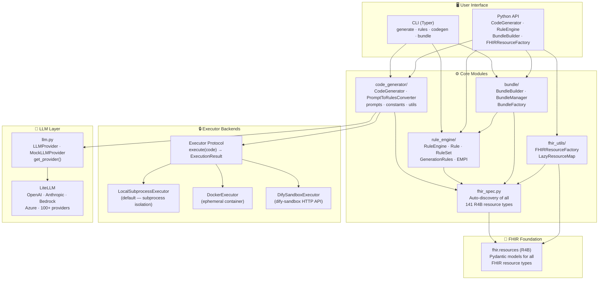
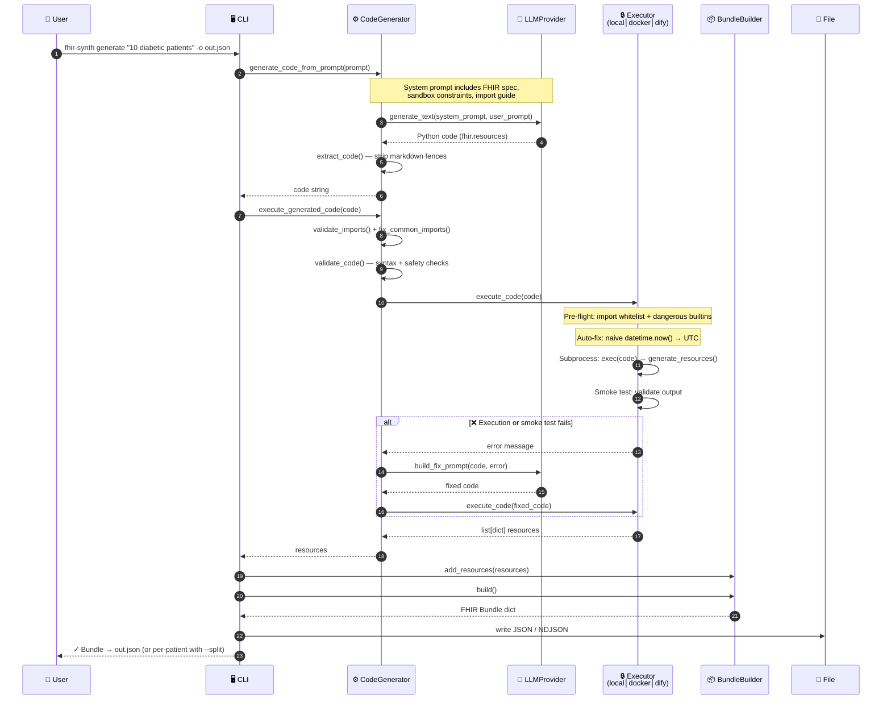
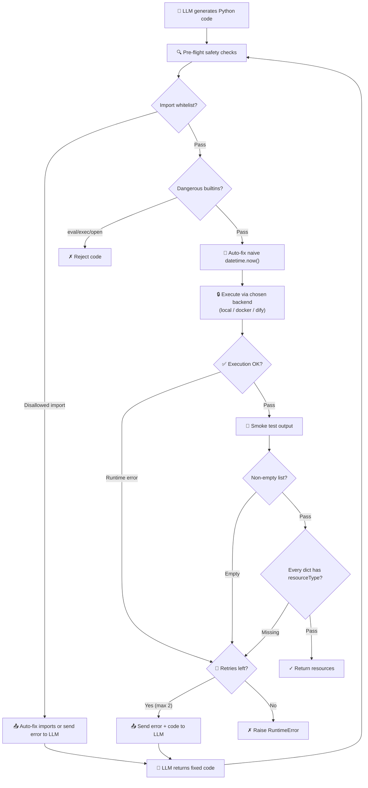

# Architecture

## System Overview


```mermaid
graph TB
    subgraph UI["🖥️ User Interface"]
        CLI["CLI (Typer)\ngenerate · rules · codegen · bundle"]
        API["Python API\nCodeGenerator · RuleEngine\nBundleBuilder · FHIRResourceFactory"]
    end

    subgraph CORE["⚙️ Core Modules"]
        CG["code_generator/\nCodeGenerator · PromptToRulesConverter\nprompts · constants · utils"]
        RE["rule_engine/\nRuleEngine · Rule · RuleSet\nGenerationRules · EMPI"]
        BB["bundle/\nBundleBuilder · BundleManager\nBundleFactory"]
        FU["fhir_utils/\nFHIRResourceFactory\nLazyResourceMap"]
        FS["fhir_spec.py\nAuto-discovery of all\n141 R4B resource types"]
    end

    subgraph EXEC["🔒 Executor Backends"]
        EX_IF["Executor Protocol\nexecute(code) → ExecutionResult"]
        LOCAL["LocalSubprocessExecutor\n(default — subprocess isolation)"]
        DOCKER["DockerExecutor\n(ephemeral container)"]
        DIFY["DifySandboxExecutor\n(dify-sandbox HTTP API)"]
    end

    subgraph LLM_LAYER["🤖 LLM Layer"]
        LLM["llm.py\nLLMProvider · MockLLMProvider\nget_provider()"]
        LITELLM["LiteLLM\nOpenAI · Anthropic · Bedrock\nAzure · 100+ providers"]
    end

    subgraph FHIR["🏥 FHIR Foundation"]
        FR["fhir.resources (R4B)\nPydantic models for all\nFHIR resource types"]
    end

    CLI --> CG
    CLI --> RE
    CLI --> BB
    API --> CG
    API --> RE
    API --> BB
    API --> FU

    CG --> EX_IF
    EX_IF --> LOCAL
    EX_IF --> DOCKER
    EX_IF --> DIFY

    CG --> LLM
    CG --> FS
    RE --> FS
    BB --> RE
    BB --> FS
    FU --> FS
    LLM --> LITELLM
    FS --> FR
    FU --> FR
```

---

## Generate Command — Data Flow

The primary workflow: prompt → LLM → code → safety checks → sandbox exec → smoke test → FHIR Bundle.


```mermaid
sequenceDiagram
    autonumber
    participant U as 👤 User
    participant CLI as 🖥️ CLI
    participant CG as ⚙️ CodeGenerator
    participant LLM as 🤖 LLMProvider
    participant EX as 🔒 Executor<br/>(local│docker│dify)
    participant BB as 📦 BundleBuilder
    participant F as 💾 File

    U->>CLI: fhir-synth generate "10 diabetic patients" -o out.json
    CLI->>CG: generate_code_from_prompt(prompt)

    Note over CG,LLM: System prompt includes FHIR spec,<br/>sandbox constraints, import guide
    CG->>LLM: generate_text(system_prompt, user_prompt)
    LLM-->>CG: Python code (fhir.resources)
    CG->>CG: extract_code() — strip markdown fences
    CG-->>CLI: code string

    CLI->>CG: execute_generated_code(code)
    CG->>CG: validate_imports() + fix_common_imports()
    CG->>CG: validate_code() — syntax + safety checks

    CG->>EX: execute_code(code)
    Note over EX: Pre-flight: import whitelist + dangerous builtins
    Note over EX: Auto-fix: naive datetime.now() → UTC
    EX->>EX: Subprocess: exec(code) → generate_resources()
    EX->>EX: Smoke test: validate output

    alt ❌ Execution or smoke test fails
        EX-->>CG: error message
        CG->>LLM: build_fix_prompt(code, error)
        LLM-->>CG: fixed code
        CG->>EX: execute_code(fixed_code)
    end

    EX-->>CG: list[dict] resources
    CG-->>CLI: resources

    CLI->>BB: add_resources(resources)
    CLI->>BB: build()
    BB-->>CLI: FHIR Bundle dict

    CLI->>F: write JSON / NDJSON
    CLI-->>U: ✓ Bundle → out.json (or per-patient with --split)
```

---

## Self-Healing Code Execution

When LLM-generated code fails, the error is automatically sent back to the LLM for correction (up to 2 retries). The fix prompt includes the error, the failing code, the FHIR import guide, and specific hints for common error types.


```mermaid
flowchart TD
    A["🤖 LLM generates Python code"] --> B["🔍 Pre-flight safety checks"]
    B --> B1{"Import whitelist?"}
    B1 -->|"Disallowed import"| FIX["📤 Auto-fix imports or send error to LLM"]
    B1 -->|Pass| B2{"Dangerous builtins?"}
    B2 -->|"eval/exec/open"| REJECT["✗ Reject code"]
    B2 -->|Pass| B3["🔧 Auto-fix naive datetime.now()"]
    B3 --> C["🔒 Execute via chosen backend<br/>(local / docker / dify)"]
    C --> D{"✅ Execution OK?"}
    D -->|"Runtime error"| RETRY
    D -->|Pass| E["🧪 Smoke test output"]
    E --> E1{"Non-empty list?"}
    E1 -->|Empty| RETRY
    E1 -->|Pass| E2{"Every dict has resourceType?"}
    E2 -->|Missing| RETRY
    E2 -->|Pass| F["✓ Return resources"]

    RETRY{"🔄 Retries left?"}
    RETRY -->|"Yes (max 2)"| FIX2["📤 Send error + code to LLM"]
    RETRY -->|No| H["✗ Raise RuntimeError"]
    FIX2 --> G["🤖 LLM returns fixed code"]
    FIX --> G
    G --> B
```

### Error types handled by self-healing

| Error | Auto-fix | LLM hint |
|---|---|---|
| Wrong fhir.resources import path | `fix_common_imports()` rewrites the import | Import guide with correct module paths |
| `datetime.now()` without timezone | Source rewrite to `datetime.now(timezone.utc)` | "Add timezone offset" |
| Disallowed import (`os`, `socket`, etc.) | — | "Replace with allowed alternative" |
| Pydantic `ValidationError` | — | "Fix the invalid field value" |
| Missing required field (`status`, etc.) | — | "Add the missing required field" |
| Missing `resourceType` in output | — | "Use `.model_dump(exclude_none=True)`" |
| Empty result list | — | "Ensure non-empty list" |

---

## FHIR Spec Introspection

At import time, `fhir_spec.py` scans the `fhir.resources.R4B` package and builds:

- **Module map**: `{ClassName: module_name}` for all ~141 resource types
- **Required fields**: detected via both Pydantic `is_required()` and `fhir.resources`' custom `element_required` marker
- **Reference fields**: fields with `ReferenceType` annotation
- **Import guide**: exact `from fhir.resources.R4B.{module} import {Class}` paths

This spec is injected into LLM prompts so the model knows the correct import paths and required fields for every resource type.

---

## Key Design Decisions

### LLM Integration via LiteLLM

All LLM calls go through a thin `LLMProvider` abstraction backed by [LiteLLM](https://docs.litellm.ai/), supporting 100+ providers (OpenAI, Anthropic, AWS Bedrock, Azure, Google Gemini, etc.) with a single interface. AWS Bedrock authentication is handled via `boto3` sessions with support for named profiles, SSO, and environment variables. A `MockLLMProvider` enables testing without API keys.

### Dynamic System Prompt

The system prompt is assembled dynamically from:

- **Sandbox constraints** — built from `ALLOWED_MODULES` in `constants.py`
- **FHIR spec summary** — required/optional/reference fields per resource type
- **Import guide** — introspected `from fhir.resources.R4B.{mod} import {Cls}` paths
- **Reference field map** — exact field names for Patient/Encounter/etc. linkage
- **Chain-of-thought** — step-by-step instructions for code generation

### Custom Metadata

Metadata (security labels, tags, profiles, source) is configured via YAML (`--meta-config`):

```yaml
meta:
  security:
    - system: "http://terminology.hl7.org/CodeSystem/v3-Confidentiality"
      code: "N"
      display: "Normal"
  tag:
    - system: "http://example.org/tags"
      code: "synthetic-data"
  source: "http://example.org/fhir-synth"
```

### Executor Backends

LLM-generated code runs inside a pluggable executor selected via `--executor`:

| Backend | Flag | How it works | Install |
|---|---|---|---|
| **Local subprocess** | `--executor local` (default) | Runs code in a separate Python process with import whitelist + dangerous-pattern scan | *(built-in)* |
| **Docker** | `--executor docker` | Spins up an ephemeral container (`python:3.12-slim`), pip-installs `fhir.resources`, executes code inside | `pip install "fhir-synth[docker]"` |
| **Dify Sandbox** | `--executor dify` | Sends code over HTTP to a [dify-sandbox](https://github.com/langgenius/dify-sandbox) service (seccomp + namespace isolation) | `pip install "fhir-synth[sandbox]"` |

All backends implement the `Executor` protocol and return a uniform `ExecutionResult(stdout, stderr, artifacts)`. Shared pre-flight validation (import whitelist, dangerous-pattern scan, naive datetime fix) runs before any backend executes.

### Output Modes

| Flag | Output |
|---|---|
| *(default)* | Single JSON — one Bundle with all patients |
| `--split` | One JSON file per patient in output directory |
