# Architecture

## System Overview


---

## Generate Command — Data Flow

The primary workflow: prompt → LLM → code → execute → FHIR Bundle.

```mermaid
sequenceDiagram
    autonumber
    participant U as 👤 User
    participant CLI as 🖥️ CLI
    participant CG as ⚙️ CodeGenerator
    participant LLM as 🤖 LLMProvider
    participant EX as 🔒 Sandbox Executor
    participant BB as 📦 BundleBuilder
    participant F as 💾 File

    U->>CLI: fhir-synth generate "10 diabetic patients" -o out.json
    CLI->>CG: generate_code_from_prompt(prompt)
    CG->>LLM: generate_text(system_prompt, user_prompt)
    LLM-->>CG: Python code (fhir.resources)
    CG->>CG: _extract_code() — strip markdown fences
    CG-->>CLI: code string

    CLI->>CG: execute_generated_code(code)
    CG->>CG: validate_code() — compile check
    CG->>EX: exec(code) → generate_resources()

    alt ❌ Execution fails
        EX-->>CG: error / traceback
        CG->>LLM: _retry_with_error(code, error)
        LLM-->>CG: fixed code
        CG->>EX: exec(fixed_code)
    end

    EX-->>CG: list[dict] resources
    CG-->>CLI: resources

    CLI->>BB: add_resources(resources)
    CLI->>BB: build()
    BB-->>CLI: FHIR Bundle dict

    CLI->>F: write JSON
    CLI-->>U: ✓ Bundle with N entries → out.json
```



---

## Self-Healing Code Execution

When LLM-generated code fails, the error is automatically sent back to the LLM for correction (up to 2 retries).

```mermaid
flowchart TD
    A["🤖 LLM generates Python code"] --> B{"✅ Syntax valid?"}
    B -->|No| C["📤 Send error to LLM"]
    B -->|Yes| D["🔒 Execute in sandbox"]
    D --> E{"✅ Execution succeeds?"}
    E -->|Yes| F["✓ Return resources"]
    E -->|No| G{"🔄 Retries left?"}
    G -->|"Yes (max 2)"| C
    G -->|No| H["✗ Raise RuntimeError"]
    C --> I["🤖 LLM returns fixed code"]
    I --> B
```



---

## Key Design Decisions

### LLM Integration via LiteLLM

All LLM calls go through a thin `LLMProvider` abstraction backed by [LiteLLM](https://docs.litellm.ai/), supporting 100+ providers (OpenAI, Anthropic, Bedrock, Azure, etc.) with a single interface. A `MockLLMProvider` enables testing without API keys.

### FHIR Spec Auto-Discovery

At import time, `fhir_spec.py` scans the `fhir.resources.R4B` package filesystem and builds a `{ClassName: module}` map of all ~141 resource types. Actual classes are loaded lazily on first access via `get_resource_class()`, keeping startup fast.

### Custom Metadata

Metadata (security labels, tags, profiles, source) can be applied at two levels:

- **Global** (`RuleSet.global_meta`) — applied to all resources from that ruleset
- **Per-rule** (`Rule.meta`) — merged on top of global, with rule-specific values taking precedence

For CLI usage, metadata is configured via a simple YAML file passed with `--meta-config`:

```yaml
meta:
  security:
    - system: "http://terminology.hl7.org/CodeSystem/v3-Confidentiality"
      code: "N"
      display: "Normal"
  tag:
    - system: "http://example.org/tags"
      code: "synthetic-data"
  source: "http://example.org/fhir-synth"
```

### Sandboxed Execution

Generated Python code runs in a restricted `exec()` sandbox with controlled builtins. The code must define a `generate_resources()` function that returns a list of FHIR resource dicts.
