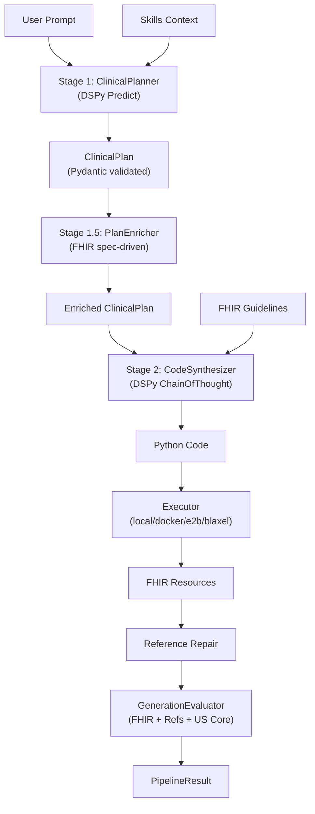

# Two-Stage DSPy Pipeline

FHIR Synth includes an optional **two-stage pipeline** powered by [DSPy](https://dspy.ai/) that separates clinical reasoning from code generation for higher quality output.

## Overview

```
Your Prompt
    ↓
Stage 1 — Clinical Planning (DSPy Predict)
    ↓  structured ClinicalPlan (Pydantic)
Stage 1.5 — Dependency Enrichment
    ↓  auto-adds Practitioner, Organization, etc.
Stage 2 — Code Synthesis (DSPy ChainOfThought)
    ↓  Python code using fhir.resources
Post-processing
    ↓  reference repair → quality evaluation
FHIR Resources
```

The default single-stage pipeline sends your prompt directly to the LLM as one big request. The two-stage pipeline splits this into:

1. **Stage 1 — Clinical Planning**: Focuses the LLM on clinical content — realistic disease codes, demographics, medication names, care settings. Outputs a structured `ClinicalPlan` (Pydantic model, validated at construction time).
2. **Stage 1.5 — Dependency Enrichment**: Walks the FHIR dependency graph to detect missing resource companions and adds minimal stubs (Practitioner, Organization, etc.) so Stage 2 can generate reference-complete FHIR resources.
3. **Stage 2 — Code Synthesis**: Takes the structured `ClinicalPlan` + FHIR import guidelines and generates Python code. Uses DSPy's `ChainOfThought` for step-by-step reasoning.

## Installation

```bash
pip install 'fhir-synth[dspy]'
```

## CLI Usage

```bash
# Two-stage pipeline
fhir-synth generate "5 diabetic patients with HbA1c observations" --pipeline dspy

# With a pre-optimized compiled program
fhir-synth generate "5 diabetic patients" \
  --pipeline dspy --compiled-program optimized_pipeline.json

# Combine with other flags
fhir-synth generate "10 patients with hypertension" \
  --pipeline dspy \
  --provider bedrock/us.anthropic.claude-sonnet-4-5-20250929-v1:0 \
  --aws-profile my-profile --aws-region us-east-1 \
  --skills-dir ./skills \
  --split
```

## Python API

```python
from fhir_synth.llm import get_provider
from fhir_synth.pipeline.pipeline import TwoStagePipeline

llm = get_provider("gpt-4")
pipeline = TwoStagePipeline.default(llm_provider=llm)
result = pipeline.run("5 diabetic patients with HbA1c observations")

# PipelineResult fields
result.plan          # ClinicalPlan (structured clinical data)
result.code          # Generated Python source code
result.resources     # list[dict] — FHIR resource dicts
result.report        # EvaluationReport (quality scores)
result.repair_report # Reference repair stats
result.selected_skills  # Skills selected for this prompt
result.total_skills     # Total available skills
```

## ClinicalPlan Model

The `ClinicalPlan` is a Pydantic model that acts as the contract between Stage 1 and Stage 2:

```python
from fhir_synth.pipeline.models import (
    ClinicalPlan, PatientProfile, ClinicalFinding, Coding, MedicationEntry,
)

plan = ClinicalPlan(
    patients=[
        PatientProfile(
            age=55,
            gender="male",
            conditions=[
                ClinicalFinding(
                    coding=Coding(
                        system="http://snomed.info/sct",
                        code="44054006",
                        display="Type 2 diabetes mellitus",
                    ),
                    onset_description="5 years ago",
                )
            ],
            medications=[
                MedicationEntry(
                    rxnorm_code="6809",
                    display="Metformin 500mg",
                    dose="500mg",
                    frequency="twice daily",
                )
            ],
        )
    ],
    care_setting="outpatient clinic",
    encounter_type="routine visit",
)
```

### Key Model Types

| Model | Description |
|-------|-------------|
| `ClinicalPlan` | Top-level plan with patients, care setting, and care team |
| `PatientProfile` | Demographics, conditions, medications, allergies, timeline |
| `ClinicalFinding` | A diagnosis or observation with SNOMED/LOINC coding |
| `MedicationEntry` | An RxNorm-coded medication with dose and frequency |
| `EncounterEvent` | A single encounter in a longitudinal timeline |
| `LabValue` | A lab or vital sign measurement (LOINC-coded) |
| `MedicationAction` | A medication start/change/stop event at an encounter |
| `PlannedResource` | Any additional FHIR resource to generate |
| `CareTeamMember` | A provider resource (Practitioner, Organization, etc.) |

### Longitudinal Timelines

For patients with multiple encounters over time, use the `timeline` field:

```python
PatientProfile(
    age=55,
    gender="male",
    care_start_date="2024-01-15",
    timeline=[
        EncounterEvent(
            month_offset=0,
            encounter_class="AMB",
            reason_display="Initial diabetes workup",
            labs=[LabValue(loinc_code="4548-4", display="HbA1c", value=8.5, unit="%")],
            medication_changes=[
                MedicationAction(action="start", rxnorm_code="6809", display="Metformin 500mg")
            ],
        ),
        EncounterEvent(
            month_offset=3,
            encounter_class="AMB",
            reason_display="Quarterly diabetic follow-up",
            labs=[LabValue(loinc_code="4548-4", display="HbA1c", value=7.2, unit="%")],
        ),
    ],
)
```

## Dependency Enrichment (Stage 1.5)

The `PlanEnricher` automatically detects missing resource dependencies by walking the FHIR spec:

- If the plan generates `MedicationRequest` resources, it checks whether the `requester` field needs a `Practitioner` or `Organization`
- If the plan generates `Encounter` resources, it checks for `serviceProvider` (Organization) and `participant` (Practitioner)
- All enrichment is **spec-driven** — no resource types or field names are hardcoded

```python
from fhir_synth.pipeline.plan_enricher import PlanEnricher

enricher = PlanEnricher()
enriched_plan = enricher.enrich(plan)
# enriched_plan.care_team may now include Practitioner, Organization stubs
```

## Quality Evaluation

The pipeline evaluates generated resources using three composable metrics:

| Metric | Weight | What it checks |
|--------|--------|---------------|
| **FHIR Validation** | 40% | Pydantic model validation (required fields, types) |
| **Reference Integrity** | 35% | All internal references point to existing resources |
| **US Core Compliance** | 25% | Must-support field coverage for US Core profiles |

```python
from fhir_synth.pipeline.evaluator import GenerationEvaluator

evaluator = GenerationEvaluator()
report = evaluator.evaluate(resources)

print(f"Score: {report.overall_score:.2f} ({report.grade})")
# Grade scale: A+ (≥0.95), A (≥0.90), B+ (≥0.85), B (≥0.80), C (≥0.70), F (<0.70)
```

## DSPy Optimization

The pipeline is designed for DSPy optimization. After collecting training examples, use `BootstrapFewShot` or `MIPROv2` to automatically improve prompts:

```bash
python examples/optimize_pipeline.py
```

This will:

1. Define training prompts (just natural language — no labels needed)
2. Run `BootstrapFewShot` to find few-shot examples that maximize quality
3. Save the optimized module to `optimized_pipeline.json`
4. Load and reuse via `--compiled-program` flag

```python
# After optimization, use the compiled program
fhir-synth generate "5 patients" --pipeline dspy --compiled-program optimized_pipeline.json
```

### When to Optimize

| Scenario | Optimizer | Training Examples |
|----------|-----------|-------------------|
| Quick start | `BootstrapFewShot` | 3–10 prompts |
| Production | `MIPROv2` | 20+ prompts |
| Domain-specific | `BootstrapFewShot` + custom skills | 5–15 domain prompts |

## Architecture



## Protocols

The pipeline uses dependency injection with runtime-checkable protocols:

| Protocol | Stage | Method |
|----------|-------|--------|
| `ClinicalPlanner` | Stage 1 | `plan(prompt, skills_context) → ClinicalPlan` |
| `ClinicalPlanEnricher` | Stage 1.5 | `enrich(plan) → ClinicalPlan` |
| `CodeSynthesizer` | Stage 2 | `synthesize(plan) → str` |
| `QualityMetric` | Evaluation | `score(resources) → float` |

You can implement these protocols with any backend — DSPy, raw LLM calls, or deterministic stubs for testing.

